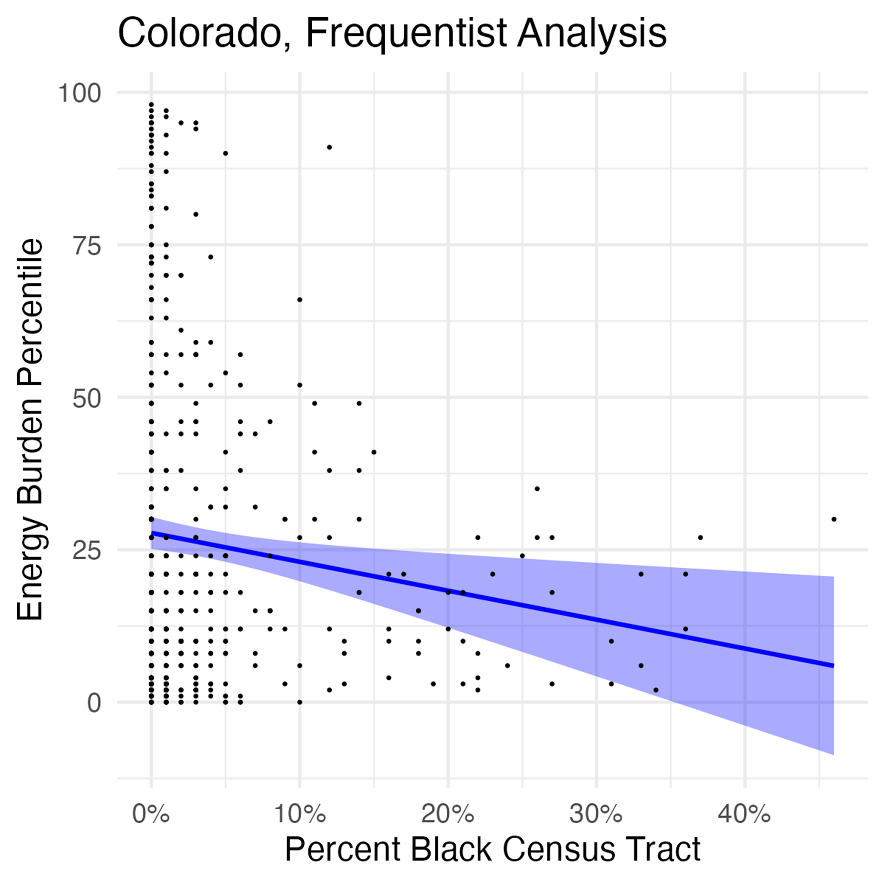
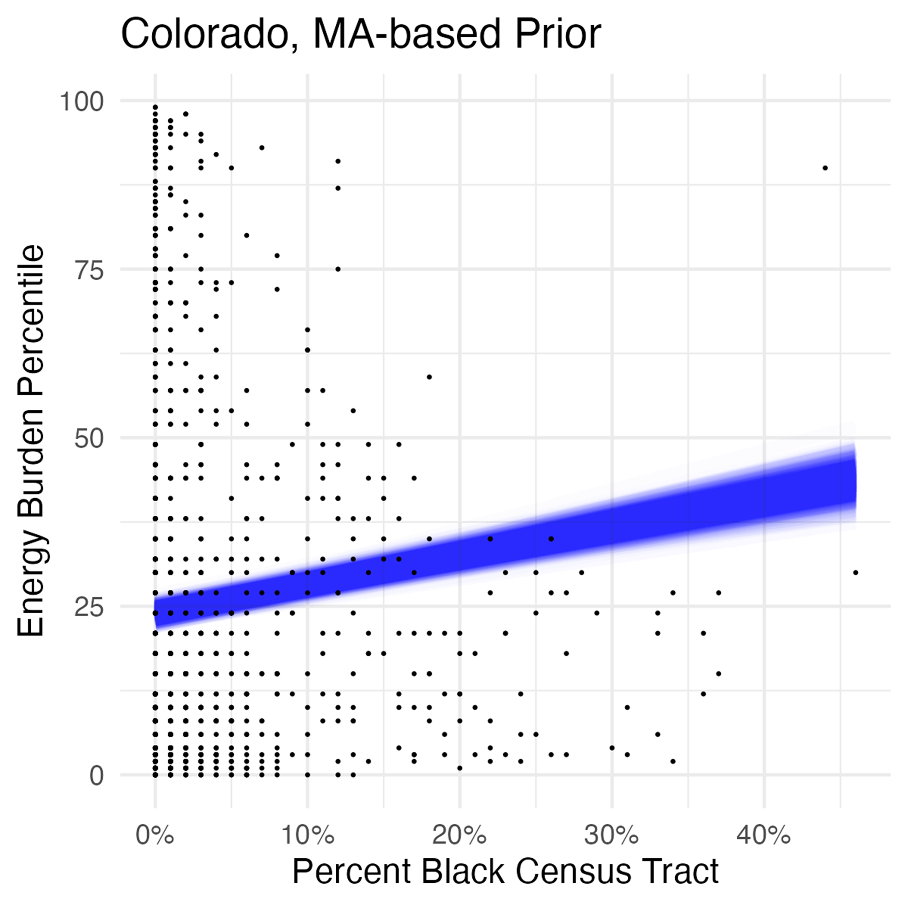
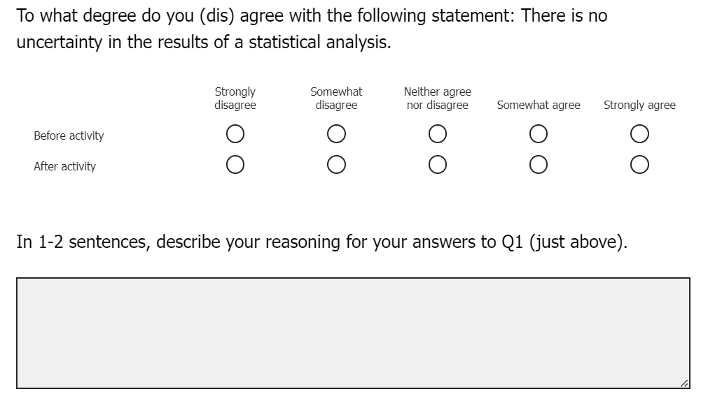

```{r setup, include=FALSE}
options(htmltools.dir.version = FALSE)
library(fontawesome)
```

```{r xaringan-themer, include=FALSE, warning=FALSE}
library(xaringanthemer)
style_mono_accent(base_color = "#2F4F4F",
  header_font_google = google_font("Yanone Kaffeesatz","200","300","400","500","600","700"),
  text_font_google   = google_font("Roboto", "300", "300i","400","500"),
  code_font_google   = google_font("Fira Mono"),
  text_font_size = "125%", 
  colors = c(
  red = "#f34213",
  purple = "#3e2f5b",
  orange = "#ff8811",
  green = "#136f63",
  white = "#FFFFFF",
  gold = "#FFD700",
  crimson = "#8B0000"
),
extra_css = list(
    ".remark-slide table" = list("display" = "table",
                   "width" = "80%",
                   "text-align" = "left"),
    ".remark-slide-number" = list("display" = "%current%"),
    ".strong" = list("font-weight" = "400"),
    ".big" = list("font-size" = "350%",
                  "font-family" = "Yanone Kaffeesatz",
                  "font-weight"="400"),
    ".small" = list("font-size" = "80%"),
    ".large" = list("font-size" = "180%"))
)

```

class: left, bottom, inverse
.big[Statistical Inference in Social Science Classrooms]

---
# Statistical Inference in Social Science Classrooms

- Traditional Frequentist methods (NHST) are taught in social science classrooms, particularly public policy and political science.

- Two considerations:
  1. Teaching quantitative methods alongside substantive theories is hard (Connelly et al. 2021; Gunn 2017; Bates & Jenkins 2007)
  2. Different methods produce different outcomes (Luque & Sosa 2023; Gill & Witko 2013)
  
- Bayesian methods provide an intuitive, and perhaps more appropriate, approach for answering public policy questions (Gill & Witko 2013; Wagner & Gill 2005) 

---
# Statistical Inference in Social Science Classrooms

.pull-left[
```{r, echo=FALSE, out.width="80%", fig.align='center', fig.cap="The 5E Instructional Model (Duran & Duran 2004)"}
knitr::include_graphics("01-mpsa-5E.png")
```
]

.pull-right[Activating epistemological frames:
- _Engage._ Get students interested
- _Explore._ Students do self-directed inquiry
- _Explain._ Give students conceptual tools
- _Elaborate._ Let students work with the tools
- _Evaluate._ Assess the learning outcomes
]

---
#  Statistical Inference in Social Science Classrooms

__The Big Idea:__ 

Introduce an applied learning activity for students of public policy
that exposes them to Bayesian methods + explores the differences between
this statistical paradigm and more commonly used approaches.

__Activity Learning Goals:__
1. Evaluate hypotheses with inferential statistical models
2. Connect (1) with real-world factors
3. Understand how Frequentists vs. Bayesian assumptions can lead to different conclusions

__Overall Goal:__

Engineer a “classroom controversy” to motivate students to find their own understanding of (3).
---

class: left, bottom, inverse
.big[Applied Activity: Comparing Frequentist & Bayesian Approaches]

---
# Applied Activity: Comparing Frequentist & Bayesian Approaches

- Students were recruited for the pilot version of the activity from the University of Denver and Olin College of Engineering.

- __Activity cadence:__

  $\rightarrow$ Problem Context 
  
  $\rightarrow$ Activity Introduction
  
  $\rightarrow$ Activity Application 
  
  $\rightarrow$ Activity Closing

---
# Applied Activity: Comparing Frequentist & Bayesian Approaches

__Context__

- Dataset: [Climate and Economic Justice Screening Tool (CEJST)](https://screeningtool.geoplatform.gov/en/#3/33.47/-97.5) 
  - Executive Order issued by President Biden in January 2021
  - U.S. Census tract level data on dozens of indicators

- Exploratory data analysis (EDA)

```{r, echo=FALSE, out.width="35%", fig.align='center'}
knitr::include_graphics("01-mpsa-context.png")
```

---
# Applied Activity: Comparing Frequentist & Bayesian Approaches

__Introduction__

- Students review and discuss ideas around statistical inference 

- Research Question: Do Black Americans experience a disproportionate level of energy burden?

- Critical differences one-pager

.pull-left[
```{r, echo=FALSE, out.width="90%", fig.align='center'}
knitr::include_graphics("01-mpsa-tab1.png")
```

]

.pull-right[
```{r, echo=FALSE, out.width="90%", fig.align='center'}
knitr::include_graphics("01-mpsa-tab2.png")
```

]

---

# Applied Activity: Comparing Frequentist & Bayesian Approaches

__Activity Application__: There's a catch!

.pull-left[Frequentist version:
1. Overview of a Frequentist statistical model
2. Assessing estimates and confidence
3. Outcomes across different states

```{r, echo=FALSE, out.width="45%", fig.align='center'}

```
]


.pull-right[Bayesian version:
1. Overview of a Bayesian statistical model 
2. Assessing posteriors and confidence
3. Outcomes...pick a state for the prior

```{r, echo=FALSE, out.width="45%", fig.align='center'}

```
]

---

# Applied Activity: Comparing Frequentist & Bayesian Approaches

__Activity Closing__

- Students come together for a full class discussion about the conclusions they draw from their respective analysis.

- There's an apparent controversy here - students from the groups will have come to different conclusions.

- Students finish the activity by "jigsawing" and discussing the differences between general inference and model summaries for Frequentists and Bayesians.

---


class: left, bottom, inverse
.big[Evaluation]

---

# Evaluation

- Pre- and post-pre-survey designs were used to assess students' attitudes and awareness about statistical inference. 

- Goal: capture changes in self-perceived attitudes about a topic by asking them to consider where they think their beliefs were _before_ the activity, followed by where they think they are _now_ (Hiebert & Magnusson 2014).


```{r, echo=FALSE, out.width="45%", fig.align='center'}

```

---

# Evaluation

- Perceived attitudes about inferential statistics, both before and after the activity, were a bit of a mixed bag. 

- While the results for the Likert battery were "noisy", the open-ended responses were somewhat illuminating.

- More work to be done here...

---

class: left, bottom, inverse
.big[Discussion]

---

# Discussion

- Bayesian methods are another possibility that non-statistics disciplines should consider both in the classroom and in the wild.

- Using an applied, student-driven approach, this activity moves beyond simple comparisons by using an activity with a real-data application.

- Some evidence that the goal of equipping them with the tools & logical processes necessary to apply either approach as they see fit was met.

- Next steps

---

# .large[Thank you!]

`r fa(name = "envelope-open")` <a href="mailto:stefani.langehennig@du.edu">Email</a>

`r fa(name = "desktop")`  <a href="https://steflangehennig.github.io/">Website</a>

`r fa(name = "linkedin")` <a href="https://linkedin.com/in/stefani-langehennig-phd-418820144">LinkedIn</a>
        
`r fa(name = "github")` <a href="https://github.com/steflangehennig">GitHub</a>

`r fa(name = "orcid")` <a href="https://orcid.org/0000-0002-0897-6556">ORCID</a>


